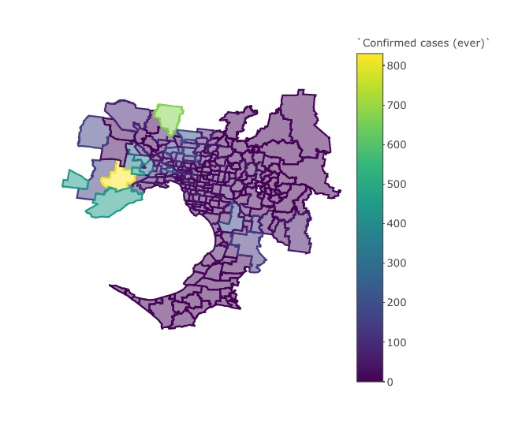

<!-- README.md is generated from README.Rmd. Please edit that file -->

# Melbourne COVID19 data and ABS variables at postcode level

<!-- badges: start -->

<!-- badges: end -->

This repository is to enable users to reproduce the analysis
underpinning the data journalism post [Postcode characteristics of
Melbourne’s COVID19
hotspots](https://www.deploythedata.com/2020/09/11/postcode-characteristics-of-melbournes-covid19-hotspots/)

This repository outlines steps undertaken to accessing and visualise
both COVID19 and ABS Census characteristics at postcode level. The
methods can be generalised to other projects.

## Data sources

Four data sources were used:

  - Will Mackey’s package `absmaps`, which makes it straightforward to
    download, compress and convert ABS shapefile data to `sf` objects in
    R. (Download and installation details are available from Will’s
    GitHub at [`absmaps`](https://github.com/wfmackey/absmapsdata).

  - August 6 August COVID19 data for Melbourne at Postcode level from
    The Age article [*Victoria coronavirus data: Find the number of
    active COVID-19 cases in your
    postcode*](https://www.theage.com.au/national/victoria/victoria-coronavirus-data-find-the-number-of-active-covid-19-cases-in-your-postcode-20200731-p55hg2.html),
    by Craig Butt and Mark Stehle. The data is available in a Google
    spreadsheet made available by the authors
    [here](https://docs.google.com/spreadsheets/d/1oxJt0BBPzk-w2Gn1ImO4zASBCdqeeLJRwHEA4DASBFQ/edit#gid=0).
    It is also stored in *Inputs/COVID19.Confirmed.cases.20.09.06.csv*

  - A user friendly Suburbs list from the Butt and Stehle article stored
    in *Inputs/melbourne.postcode.list.csv*

  - ABS Census postcode level data downloaded from the ABS website.

## 01 Get COVID19 data and Melb shapes.R

This script will enable you to read in COVID19 Date at postcode level,
match postcodes to surburb names and visualise COVID19 on 6 August.

The plot is not meaningful story as the cumulative case numbers have not
yet been rationalised for population, however it should appear as
follows

The joined Melbourne shapes and COVID dataset is in
**Outputs/Melbourne.case.data.RDS**.

## 02 Download ABS tables at Postcode level.R

Running this script downloads the ABS DataPack for the 2016 Census in
Victoria at Postcode level.

The Census data table are mapped to a nested list named `pc` and each
sub element is named according to its name in the Census metadata.

This object is stored in **Outputs/ABS.Victoria.postcodes.RDS**.

Once the file is unzipped I highly recommend reviewing the Metadata
files. This is loaded into the global environoment and also available
at: */2016\_GCP\_POA\_for\_Vic\_short-header/2016 Census GCP Postal
Areas for VIC/Metadata/Metadata\_2016\_GCP\_DataPack.xlsx* .

## 03 Join and Explore ABS and COVID19 data.R

This script sequentially links the COVID data file with ABS data tables
and considers relationships at postcode level. The steps taken ar as
follows.

  - Joins the COVID19 data with ABS table *G01 Selected Person
    Characteristics by Sex* which gives population tally for each
    postcode on census night. The postcode population is used to derive
    Cumulative Cases per 100K of residents.

  - Identifies outlier postcodes - postcodes with less than 1500
    residents, and for recently developed suburbs, counts were not
    meaningful.

  - Creates a choropleth to verify that things look as they should.

  - Links normalised COVID19 data and runs Pearson correlation against:
    
      - G01: *Selected Person Characteristics by Sex* normalised by
        Persons;  
      - G51: *Industry of Employment by Age by Sex* normalised by
        employed persons aged 15 years and over
      - G17: *Total Personal Income (Weekly) by Age by Sex* normalised
        by Persons aged 15 and over;
      - G33: *Tenure Type and Landlord Type by Dwelling Structure*
        normalised by occupied private dwellings;
      - G32: *Dwelling Structure* normalised by persons in occupied
        private dwelling;
      - G37: *Dwelling Internet Connection by Dwelling Structure*
        normalised by occupied private dwellings;
      - G02: *Selected Medians and Averages* normalised by Persons; and
      - G53: *Industry of Employment by Occupation* normalised by
        employed persons aged 15 years and over.

COVID19 data and normalised variables along with spatial information are
saved in **Outputs/Melbourne.spatial.COVID19.RDS**.

## 04 REPORT Demographic.community.spread.Rmd

This Rmarkdown script reproduces the data blog post at Deploy the data
entitled [Postcode characteristics of Melbourne’s COVID19
hotspots](https://www.deploythedata.com/2020/09/11/postcode-characteristics-of-melbournes-covid19-hotspots/).

Please let me know if you have any questions or improvements at
<monikasarder@gmail.com> .
